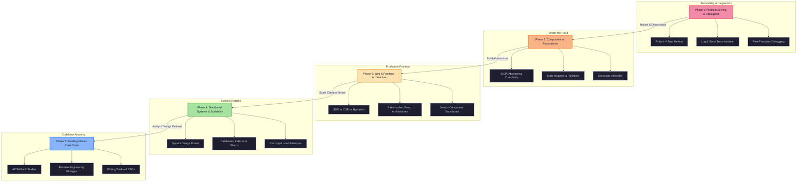

# Developer to Principal Engineer: Foundational Study Plan

This study plan is designed to help you bridge the gap between "moving fast with AI" and "building rock-solid foundations." It progresses from core problem-solving models to system design, frontend architecture, and reading production-grade source code.

---

## 🗺️ Visual Roadmap (Infographic)

---

## 📅 Timeline & Fine-Grained Weekly Plan

```mermaid
gantt
    title Learning Path Timeline (12 Weeks)
    dateFormat  X
    axisFormat %d

    section Phase 1
    Debugging & Problem-Solving Methodologies (Weeks 1-2) :active, 0, 14
    section Phase 2
    Computational Foundations (SICP) (Weeks 3-4) : 14, 28
    section Phase 3
    Frontend Architecture & Performance (Weeks 5-6) : 28, 42
    section Phase 4
    Distributed Systems & Scalability (Weeks 7-9) : 42, 63
    section Phase 5
    Reading Production Code & Patterns (Weeks 10-12) : 63, 84
```

---

## 🛠️ Phase-by-Phase Syllabus

### 🛑 Phase 1: Problem Solving, Debugging & System Diagnostics
**Duration:** Weeks 1–2  
**Focus:** Stopping the "guess and check" cycle. Moving from visual glitches to systematic root-cause discovery.

#### 📖 Core Reading Resources
*   **Book:** *How to Solve It* by George Pólya (Read Chapters 1 & 2 on Understanding and Deconstruction).
*   **Guide:** [A Guide to Debugging](https://architectureinplay.com/) and mental isolation models.

#### 🎯 Fine-Grained Topics & Concepts
1.  **Polya’s 4-Step Loop:**
    *   *Understand:* Restate the bug in your own words. Identify inputs, expected outputs, and actual outcomes.
    *   *Plan:* Determine if you've seen a similar bug before. Formulate a testable hypothesis.
    *   *Execute:* Change **exactly one variable at a time**. Keep notes.
    *   *Verify:* Confirm the bug is gone, check for side effects, and document *why* the fix worked.
2.  **StackTrace Anatomy:**
    *   Distinguish between compile-time errors (TypeScript, bundlers), server runtime errors (Node/Next.js APIs), and client runtime errors (browser console).
    *   Identifying file origins, external packages, and error boundaries in logs.
3.  **Boundary Isolation:**
    *   Reducing the scope of a bug by removing dependencies or features until the simplest broken case is left.

#### 💻 Practical Exercises
*   **Exercise 1 (Log Capture):** The next time your application throws an error, copy the entire terminal log. Highlight the absolute first file in *your* codebase that triggered the error (ignoring `node_modules`). Map out the call chain.
*   **Exercise 2 (Friction Testing):** Intentionally break your Supabase database connection string in your local environment. Run the server and write down exactly how the application fails. Does it fail gracefully with a custom message, or crash the thread? Write a fix for it.

#### 🤖 AI-Pairing Prompt
> *"I am debugging an issue where [insert error message/behavior]. Do not write the code to fix it. Instead, act as a senior mentor and guide me through George Pólya's 4-step framework. Ask me clarifying questions one by one to help me isolate the root cause."*

---

### 🧱 Phase 2: Computational Foundations & Abstraction
**Duration:** Weeks 3–4  
**Focus:** Building a vocabulary for functional design, state mutation, and execution scope.

#### 📖 Core Reading Resources
*   **Book:** [Structure and Interpretation of Computer Programs (SICP)](https://mitpress.mit.edu/sites/default/files/sicp/index.html) (Chapters 1 & 2).
*   **Resource:** [JavaScript Info: Advanced Working with Functions](https://javascript.info/advanced-functions) (Closures, execution contexts).

#### 🎯 Fine-Grained Topics & Concepts
1.  **Building Abstractions:**
    *   Distinguishing between data abstractions (how objects are shaped) and procedural abstractions (how operations are run).
2.  **Pure Functions & Side Effects:**
    *   Understanding how global mutations break code predictability. Learning to write pure, testable utility helper files.
3.  **Recursion vs. Iteration:**
    *   How compilers handle stack memory allocation during loops vs. recursive calls.

#### 💻 Practical Exercises
*   **Exercise 1 (Refactoring to Pure Functions):** Take a component that modifies external variables or states directly inside its logic. Rewrite it so all mutations happen within isolated state hooks, and extract pure logic helper functions out of the component.
*   **Exercise 2 (The Scheme Translation):** Install a Scheme interpreter or use an online playground. Write a simple fibonacci function and a list filtering function in Scheme. Observe how coding without standard arrays forces you to think about recursion and lists.

#### 🤖 AI-Pairing Prompt
> *"Look at this function: [insert code snippet]. Explain how I can refactor it to make it a pure function with zero side effects. Then, explain the mathematical concept of abstraction behind this change."*

---

### 🌐 Phase 3: Web & Frontend Architecture (React/Next.js Depth)
**Duration:** Weeks 5–6  
**Focus:** Understanding how the browser, the server, and frontend frameworks communicate.

#### 📖 Core Reading Resources
*   **Book/Web:** [Patterns.dev](https://patterns.dev/) (Focus on Design Patterns, Rendering Patterns).
*   **Documentation:** [Next.js Internals and API Docs](https://nextjs.org/docs) (Server Components vs Client Components, Suspense, and Hydration).

#### 🎯 Fine-Grained Topics & Concepts
1.  **Modern Rendering Strategies:**
    *   *Client-Side Rendering (CSR):* Static HTML shell, JS fetches data and renders layout.
    *   *Server-Side Rendering (SSR):* HTML generated per request.
    *   *Static Site Generation (SSG):* HTML built once at compile time.
    *   *Hydration:* The process where Client-side JavaScript attaches event listeners to Server-rendered HTML.
2.  **Architectural Component Boundaries:**
    *   Why state and client hooks (`useState`, `useEffect`, click events) must live inside Client Components.
    *   How to structure page layouts to load static components instantly while streaming dynamic sections with Suspense.
3.  **State Synchronization:**
    *   Keeping local component state, context state, and backend database state (like Supabase) in sync without infinite loops.

#### 💻 Practical Exercises
*   **Exercise 1 (Hydration Analysis):** Open your project’s dev tools network tab. Slow the network speed down to 3G. Refresh the page. Look at what renders first (HTML) vs when interactive elements (buttons, inputs) become clickable.
*   **Exercise 2 (Next.js Layout Restructure):** Convert a page that relies entirely on client rendering (`"use client"`) into a Server Component layout. Keep all data fetching on the server, and isolate interactive sections (modals, search bars) into smaller, leaf-node Client Components.

#### 🤖 AI-Pairing Prompt
> *"I want to optimize a layout that has a heavy state component inside it. Show me how to split the page layout into Server-Side rendering parts and isolated Client Components. Explain what happens during React's hydration phase for this split."*

---

### 🗄️ Phase 4: Distributed Systems & Scalability
**Duration:** Weeks 7–9  
**Focus:** Understanding what happens when your single-server app scales to thousands of concurrent requests.

#### 📖 Core Reading Resources
*   **Guide:** [The System Design Primer](https://github.com/donnemartin/system-design-primer) (Read sections on Client-Server, Web Server, Database, Cache, and Load Balancers).
*   **Tutorial:** [Database Indexes Explained](https://use-the-index-luke.com/) (Understand how databases locate data).

#### 🎯 Fine-Grained Topics & Concepts
1.  **System Scaling:**
    *   Horizontal scaling (adding more instances) vs. Vertical scaling (adding more CPU/RAM).
2.  **Database Query Optimization:**
    *   Why query execution plans scan tables. How B-Tree indexes speed up lookups, and the write-performance cost of indexes.
3.  **Caching Layers:**
    *   Implementing cache-aside systems (e.g., Redis). Cache invalidation patterns (TTL, write-through).
4.  **Rate Limiting & Queueing:**
    *   How message brokers (RabbitMQ/Kafka) prevent database crashes during high-traffic bursts.

#### 💻 Practical Exercises
*   **Exercise 1 (Index Performance Test):** Set up a local database table (PostgreSQL/Supabase). Populate it with 10,000 mock rows. Run an unindexed search query using `EXPLAIN ANALYZE`. Create an index on the searched column and run `EXPLAIN ANALYZE` again. Document the execution time difference.
*   **Exercise 2 (System Design Diagram):** Draw a visual system architecture diagram for a system like Twitter or YouTube. Highlight where requests hit load balancers, where cache reads happen, and how databases write logs.

#### 🤖 AI-Pairing Prompt
> *"Explain how database indexes work under the hood using a B-Tree structure. Walk me through the step-by-step performance cost when reading vs. writing data, and how to verify it using PostgreSQL's EXPLAIN ANALYZE."*

---

### 🎨 Phase 5: Reading Master-Class Code & Design Patterns
**Duration:** Weeks 10–12  
**Focus:** Learning by observing how production-ready open-source software is designed and organized.

#### 📖 Core Reading Resources
*   **Book:** [The Architecture of Open Source Applications](https://aosabook.org/en/index.html) (Select chapters: Git, Nginx, or Web Server design).
*   **Book:** [Refactoring.Guru: Design Patterns](https://refactoring.guru/design-patterns) (Factory, Observer, Singleton, Strategy).

#### 🎯 Fine-Grained Topics & Concepts
1.  **Design Patterns:**
    *   *Observer Pattern:* Component event listeners and store subscriptions.
    *   *Strategy Pattern:* Swapping logic execution pathways cleanly (e.g., swapping payment providers).
    *   *Factory Pattern:* Decoupling object creation logic from client interfaces.
2.  **Codebase Exploration Tactics:**
    *   How to read an open-source codebase without getting overwhelmed (find the entry point, trace a single core flow, map out the directory architecture).

#### 💻 Practical Exercises
*   **Exercise 1 (Open Source Walkthrough):** Go to the GitHub repository of a library you use daily (e.g., `axios`, `clsx`, or a small React utility). Find the entry file in the `src` folder. Trace exactly how it takes user input and returns output. Write a 1-page breakdown of its internal flow.
*   **Exercise 2 (Strategy Pattern Refactor):** Create a service that needs to send notifications (SMS, Email, or Slack). Instead of writing complex `if/else` checks, write it using the Strategy Pattern, creating clean, pluggable adapter classes for each notification system.

#### 🤖 AI-Pairing Prompt
> *"Analyze this piece of conditional logic: [insert snippet]. Help me refactor this code using the Strategy Pattern. Explain how this refactored structure makes it easier to extend in the future without modifying existing logic (Open/Closed Principle)."*

---

## 🏆 The Core Problem-Solving Checklist
Keep this checklist on your desk. Use it every single time you encounter a bug or design a feature:

- [ ] **Step 1: Write it down.** Can you state the goal or problem in one simple sentence without using jargon?
- [ ] **Step 2: Trace the data flow.** Where does the inputs enter, how does it morph, and where does it output?
- [ ] **Step 3: Define the constraint.** Is it database-heavy, rendering-heavy, network-bound, or logic-bound?
- [ ] **Step 4: Design the simplest fallback.** If the external service fails, what is the best local user experience we can provide?
- [ ] **Step 5: Review the trade-offs.** Does this add a dependency? Does this hurt performance? Does it increase cognitive load?
